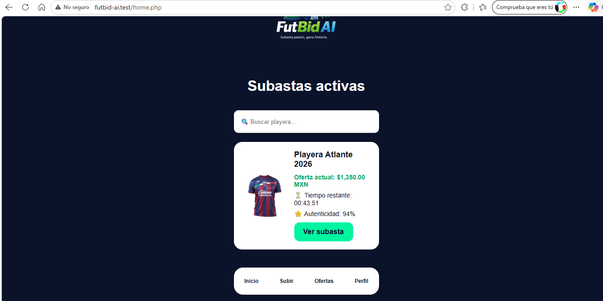
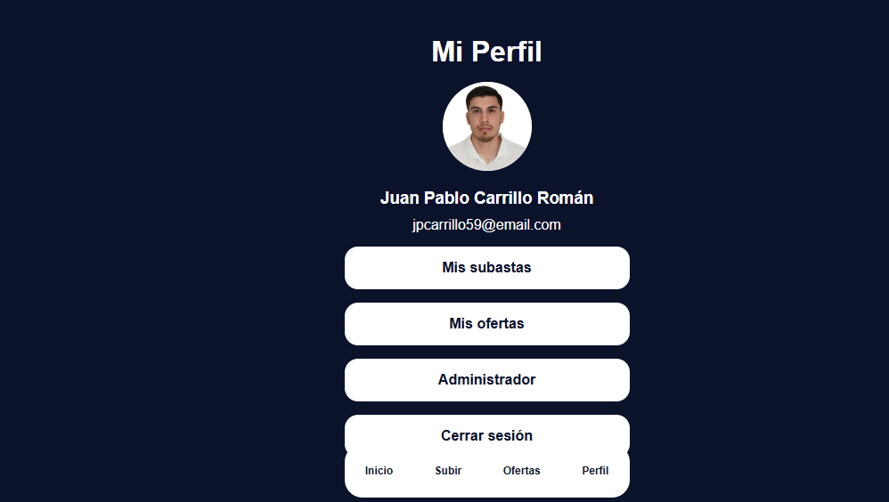
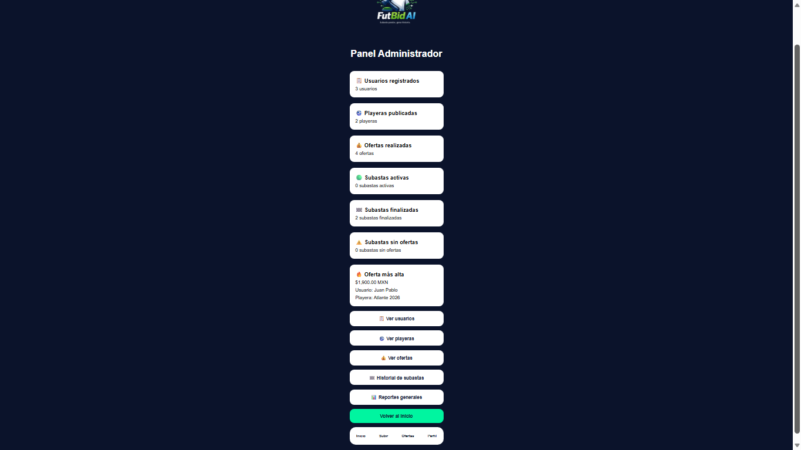
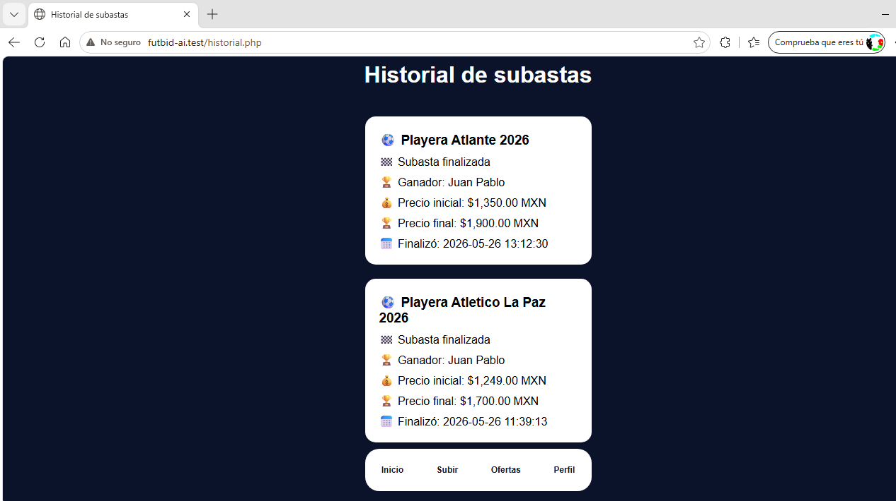
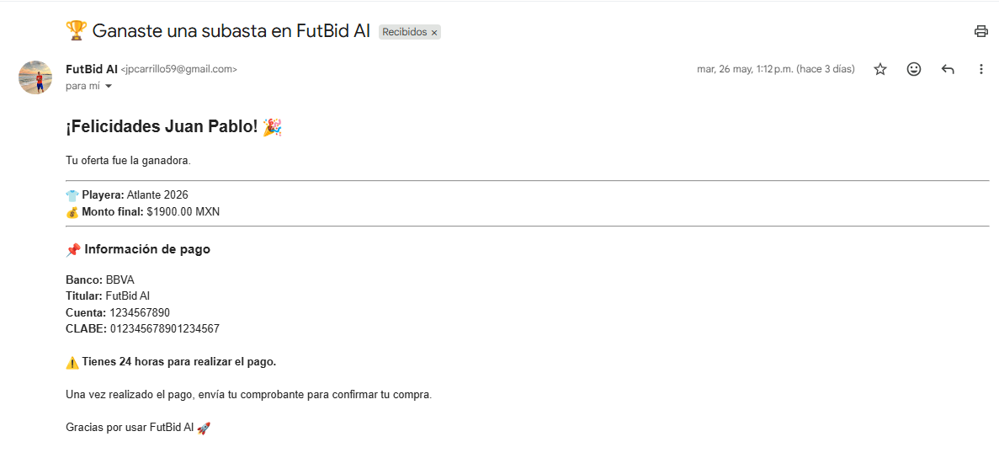
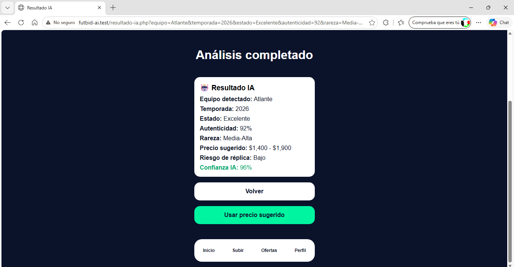

# FutBid AI

Plataforma inteligente de subastas de playeras deportivas con análisis mediante Inteligencia Artificial, gestión de usuarios, panel administrativo y notificaciones automáticas por correo electrónico.

---

## Descripción del proyecto

FutBid AI es una aplicación web desarrollada para la gestión de subastas de playeras deportivas. El sistema permite a los usuarios registrarse, publicar playeras, participar en subastas y recibir notificaciones automáticas cuando resultan ganadores.

Además, integra un módulo de análisis inteligente capaz de estimar características de la playera, como autenticidad, rareza y precio sugerido, con el objetivo de brindar mayor información al usuario antes de realizar una oferta.

---

## Características principales

- Registro de usuarios
- Inicio de sesión seguro
- Gestión de perfiles
- Publicación de playeras deportivas
- Sistema de ofertas en tiempo real
- Análisis inteligente de playeras
- Cálculo de autenticidad
- Precio sugerido mediante IA
- Historial de subastas
- Panel administrativo
- Estadísticas generales
- Correos automáticos mediante Gmail SMTP
- Asignación automática de ganadores
- Historial de subastas finalizadas

---

## Tecnologías utilizadas

### Backend

- PHP
- MySQL
- PHPMailer

### Frontend

- HTML5
- CSS3
- JavaScript

### Base de datos

- MySQL 8

### Herramientas de desarrollo

- Laragon
- HeidiSQL
- Git
- GitHub
- Visual Studio Code

### Servicios externos

- Gmail SMTP
- PHPMailer

---

## Funcionalidades

### Gestión de usuarios

- Registro de usuarios
- Inicio de sesión
- Cierre de sesión
- Perfil personalizado
- Roles de usuario y administrador

### Gestión de playeras

- Publicación de playeras
- Carga de imágenes
- Información detallada de cada artículo
- Visualización de autenticidad y rareza
- Visualización del precio sugerido

### Sistema de subastas

- Publicación de ofertas
- Actualización de oferta más alta
- Identificación de usuario ganador
- Temporizador de cierre
- Estado de subasta activa o finalizada
- Asignación automática de ganador

### Historial

- Historial de ofertas realizadas
- Historial de subastas ganadas
- Historial de subastas finalizadas

### Notificaciones

- Envío automático de correo al ganador
- Información de pago
- Confirmación de resultado de la subasta

### Administración

- Panel administrativo
- Estadísticas generales
- Gestión de usuarios
- Gestión de playeras
- Gestión de ofertas
- Reportes generales
- Gráficas estadísticas

---

## Inteligencia Artificial

El sistema incorpora un módulo de análisis inteligente que permite generar información relevante sobre las playeras publicadas.

### Funciones del análisis IA

- Identificación del equipo deportivo
- Estimación de autenticidad
- Estimación de rareza
- Cálculo de precio sugerido
- Generación de nivel de confianza

### Información generada

- Equipo identificado
- Porcentaje de autenticidad
- Rareza estimada
- Precio sugerido de mercado

---

## Base de datos

### Tabla usuarios

Almacena la información de los usuarios registrados.

Campos principales:

- id
- nombre
- correo
- password
- rol
- creado_en

### Tabla playeras

Almacena la información de las playeras publicadas.

Campos principales:

- id
- usuario_id
- equipo
- jugador
- temporada
- talla
- precio_inicial
- imagen
- autenticidad
- rareza
- precio_sugerido
- fecha_cierre
- ganador_id
- finalizada

### Tabla ofertas

Almacena todas las ofertas realizadas durante las subastas.

Campos principales:

- id
- usuario_id
- playera_id
- monto
- creado_en

---

## Flujo general del sistema

1. El usuario se registra.
2. El usuario inicia sesión.
3. Publica una playera deportiva.
4. La IA analiza la imagen.
5. Se genera información de autenticidad y precio sugerido.
6. Otros usuarios realizan ofertas.
7. El sistema identifica la oferta más alta.
8. Al finalizar la subasta se asigna un ganador automáticamente.
9. El ganador recibe un correo electrónico.
10. La subasta pasa al historial.

---
## Capturas del sistema

### Página principal

### Perfil de usuario

### Panel administrador

### Historial de subastas

### Correo automático

### Módulo de análisis IA

---

## Mejoras futuras

- Integración con pasarelas de pago.
- Notificaciones en tiempo real.
- Aplicación móvil.
- Sistema de mensajería interna.
- Dashboard avanzado de analítica.
- Integración con APIs deportivas.
- Reconocimiento avanzado de imágenes mediante IA.

---

## Autor

**Juan Pablo Carrillo Román**

Proyecto desarrollado como parte de la materia de IA.

---

## Repositorio

https://github.com/JuanPa1008/FutBid-AI
